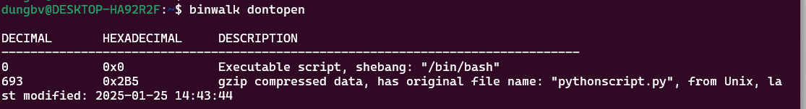
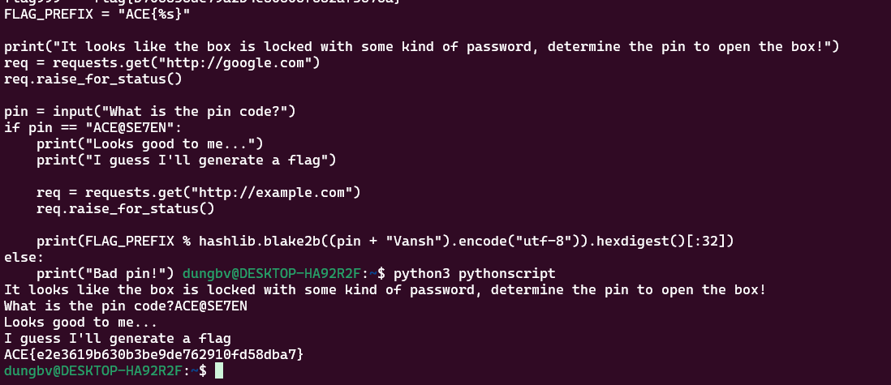

Dựa trên kết quả từ lệnh `binwalk`, bạn có thể thấy rằng tệp `dontopen` chứa một phần **gzip compressed data** ở offset `0x2B5`, và tên tệp gốc của dữ liệu nén này là `pythonscript.py`. Điều này có nghĩa là script Python bị nén lại trong tệp này và bạn cần giải nén nó để xem nội dung.

### Cách giải nén script Python từ tệp `dontopen`

1. **Sử dụng `dd` để trích xuất phần dữ liệu nén**:
   Trước tiên, bạn cần trích xuất phần nén từ tệp `dontopen` bắt đầu từ offset `0x2B5`.

   Dùng lệnh `dd` để trích xuất:
   ```bash
   dd if=dontopen of=pythonscript.gz bs=1 skip=693
   ```

   Giải thích:
   - `if=dontopen`: Đọc từ tệp `dontopen`.
   - `of=pythonscript.gz`: Lưu dữ liệu trích xuất vào tệp `pythonscript.gz`.
   - `bs=1`: Sử dụng kích thước block 1 byte.
   - `skip=693`: Bỏ qua 693 byte đầu tiên (tương đương với offset `0x2B5`).

2. **Giải nén tệp gzip**:
   Sau khi trích xuất dữ liệu, bạn sẽ có tệp `pythonscript.gz`. Tiếp theo, giải nén tệp này bằng `gzip`:

   ```bash
   gzip -d pythonscript.gz
   ```

   Lệnh này sẽ tạo ra tệp `pythonscript

3. **Kiểm tra nội dung script Python**:
   Sau khi giải nén, bạn có thể mở tệp `pythonscript`
   ```bash
   cat pythonscript

4.**Chay và nhập Ma Pin trong 'pythonscript'**


